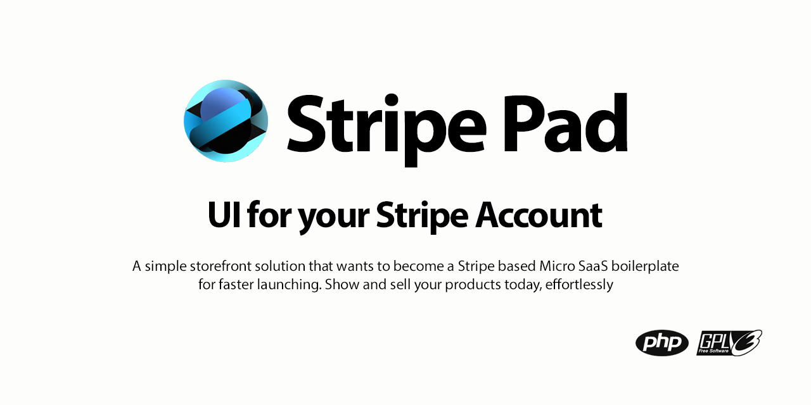

#  Stripe Pad

Stripe Pad is a Php package that helps you sell your products quickly and easily. It connects to your Stripe account and acts as an UI for selling your products.

The main objective is to be an ideal option to launch fast and validate ideas without being attached to any framework or library. Themes can be build in any way you need, being independent of the core.

### Starter Themes


## Getting Started

To get started with Stripe Pad, follow these steps:

```
  git clone https://github.com/natzar/stripe-pad.git
  cd stripe-pad
  composer install
```

Open localhost/stripe-pad from your browser. In the first run, your account details and products from your Stripe Account will be gathered and saved in /cache/data.json


## Main components

### Config.php
General settings, base urls, stripe credentials

### Cache
Data gathered from Stripe is stored in cache/data.json. In case you want to clean cache, just remove the file.

### Main controller Index.php
It includes the theme files defined in config.php, in case cache folder is empty,  it retrieves data from webhooks/stripeGetDetails.php and store the json in cache/data.json right before including index.php file from selected theme.

### Themes
The html/css for the landing that will showcase your offerings.
Inside /themes folder.
$stripeData array is passed to all themes, it is the array to make data from Stripe available to theme files.
- $stripeData['account']: Account details depends on your settings and type of Stripe account
- $stripeData['products']: Array with your products

### Webhooks
#### stripeGetDetails.php
This file is called by index.php when cache/data.json is not found

#### stripeNotifications.php
Manage notifications from Stripe after setting up a new webhook in your Stripe account. Payment received, subscription creation, invoice paid, ...


Usage & Customization


Once your Stripe account is configured, you can easily retrieve products and other details from your Stripe Account. The boilerplate also includes basic checkout functionality and a sample thank-you page.

You can also customize the look and feel of the front-end as per your need.

- Clone one of the 2 basic themes inside *themes* folder.
- Basic themes include Tailwind via CDN, no other CSS or JS
### In Production

- Add a webhook from https://dashboard.stripe.com/webhooks to https://yourdomain.com/webhooks/stripeNotifications.php to manage Stripe events.
- Remove cache/data.json every time you update your products or account settings 

## Dependencies
Dependencies are managed via composer. The challenge is maintain it with as less dependencies as posible.

- Stripe Php Wrapper
- Php Mailer


## Roadmap
Road to a micro saas boilerplate based in Stripe, to launch and validate new ideas fast:
- Add event in webhooks to clear cache after a product or account details have been updated
- Add User management, logins, signups, lost password.
- Transactional Emails
- Admin Private Area (user & payments management)
- User Private Area (after successful signup & login), the gateway to become a new ideas boilerplate to launch fast
- Load data.json via Js from themes, so Php is just an option
- Nodejs webhooks
- Add standard landing theme to launch and validate ideas


## Contributing

Any contributions to Stripe Pad are welcomed. If you have any ideas or suggestions for new features, please feel free to open an issue or submit a pull request.
- New core features
- Add a new theme
- Add a new plugin

## License

Stripe Pad is open-sourced software licensed under the GPL-3.0 license.
Project URL: [www.stripepad.com](https://www.stripepad.com)

## Disclaimer

> Not affiliated in any way with Stripe.com

## Contact 

If you have any questions or need support, please don't hesitate to reach me on Twitter [@betoayesa](https://www.twitter.com/betoayesa)

Thank you for using Stripe Pad!
